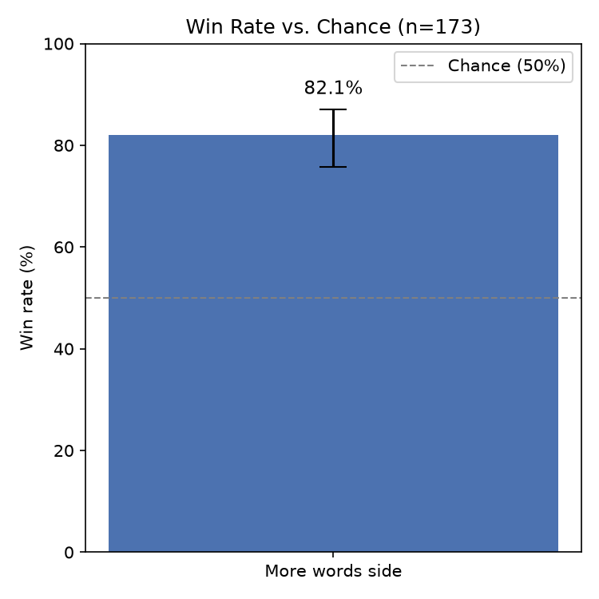

# Judge Agent: Does Word Count Win Court Cases?

A multi-agent courtroom simulation where AI attorneys argue opposing sides and a RAG-based judge evaluates evidence, arguments, and precedent cases — built to test a simple question: **does having more words to argue with actually increase your chance of winning?**

## Research Question

In an adversarial argument setting, is the outcome influenced by how much room each side has to make their case, independent of the actual facts of the dispute? This project runs a controlled experiment: two AI attorneys are given the same underlying scenario but asymmetric word limits (100 vs. 500), and an independent AI judge that decides the winner.

## How It Works

```
1. Scenario Generator  →  generates a balanced, realistic legal dispute
2. Client Accounts      →  generates messy, biased "raw" client accounts for each side
3. Attorney A / B       →  each attorney turns their client's account into a
                            formal courtroom statement, under an assigned word limit
4. Judge                →  reads both statements, optionally retrieves similar
                            past cases via a vector database (RAG), and renders a verdict
5. Result Logger        →  stores every trial (statements, word counts, verdict) in SQLite
```

**Key design choices:**
- Word limits (100 vs. 500) are randomly assigned to each side on every trial, so across the batch, both attorneys spend roughly equal time as the "advantaged" side.
- The judge never sees which side was given more words — it only sees the two statements.
- Every judged case is summarized and stored in a ChromaDB vector store, so the judge can optionally retrieve similar precedent cases for genuinely complex disputes (agentic tool use, not a hardcoded lookup).
- Local inference via [Ollama](https://ollama.com) (`qwen3:8b`) — no external API costs, fully self-contained.

## Tech Stack

- **Python** — orchestration and agent logic
- **Ollama** (`qwen3:8b`) — local LLM inference for every agent (scenario generation, attorneys, judge)
- **ChromaDB** — persistent vector store for precedent retrieval (RAG)
- **SQLite** — trial results storage
- **FastAPI** — async REST API for triggering and polling individual trials
- **pandas / scipy / matplotlib** — statistical analysis and visualization

## Results

**176 trials** were run, with word limits (100 vs. 500) randomly assigned to each side per trial.

| Metric | Value |
|---|---|
| Total trials | 176 |
| Verdicts parsed | 174 (2 excluded — verdict format could not be parsed) |
| Attorney A wins | 89 |
| Attorney B wins | 85 |
| **Win rate for the side with more words** | **82.2%** |
| 95% confidence interval | [75.8%, 87.2%] |
| p-value (binomial test vs. 50% chance) | < 0.0001 |



The side given more words to argue with won significantly more often than chance, with a large effect size that holds even at the low end of the confidence interval. Attorney A and Attorney B won a roughly equal share of trials overall (89 vs. 85 out of 174), suggesting no strong systematic bias toward either position independent of the word-count manipulation.

## Limitations & Discussion

**Sample size.** n=176 is sufficient to detect a large effect like the one observed here, but is likely underpowered to reliably detect smaller effects. A follow-up run with several hundred trials, or a finer-grained sweep of word limits (e.g. 100 / 250 / 500 / 1000), would give a more precise estimate of the effect's true size.

**Confounded variable.** The word limit is not a pure measure of "verbosity." A 500-word allowance also gives an attorney more room to develop nuanced arguments, address weaknesses in their own position, and cover more of the available evidence. This experiment cannot fully separate "wrote more words" from "made a more complete argument" — both are plausible mechanisms behind the observed effect, and disentangling them would require a different experimental design (e.g. holding argument *quality* constant while varying only length).

**Judge model bias.** The judge is a single 8B-parameter local model (`qwen3:8b`). Smaller LLMs are known to show length and elaboration biases when evaluating persuasiveness — a longer, more detailed statement may be favored partly because it *reads* as more thorough, independent of whether its underlying legal reasoning is actually stronger. Using a larger or different judge model, or an ensemble of judges, would help determine how much of this effect is specific to this particular judge.

**Position bias.** Win rates for Attorney A (89) and Attorney B (85) were close to balanced across all 174 valid trials, suggesting no strong inherent bias toward either labeled position. This is a reassuring but not fully rigorous check — a cleaner test would compare win rates specifically among trials with equal word limits, which this dataset does not contain by design.

**Reproducibility.** While the sequence of which side receives more words is seeded for consistency, the underlying LLM outputs (scenarios, arguments, verdicts) are not deterministic. Re-running the batch will produce different individual cases and likely a similar, but not identical, overall result.

## Running It

**Requirements:**
- Python 3.10+
- [Ollama](https://ollama.com) installed and running locally, with `qwen3:8b` pulled:
  ```bash
  ollama pull qwen3:8b
  ```

**Setup:**
```bash
git clone https://github.com/mpopov576/judge_agent.git
cd judge_agent
python -m venv .venv
.venv\Scripts\activate   # Windows
pip install -r requirements.txt
```

**Run a full batch of trials:**
```bash
python batch_runner.py
```

**Run the analysis (win rate, confidence interval, chart):**
```bash
python analysis.py
```

**Reset the trials database** (start fresh):
```bash
python reset_db.py
```

## REST API

The core pipeline is also exposed as an async REST API, since a single trial takes several minutes — the API returns a job ID immediately and the trial runs in the background.

**Start the server:**
```bash
uvicorn api:app --reload
```

**Trigger a trial:**
```bash
curl -X POST "http://localhost:8000/trials?word_limit_a=100&word_limit_b=500"
# {"job_id": "44024ac1-de8c-49e2-bd23-a9aa1e876e95"}
```

**Poll for the result:**
```bash
curl "http://localhost:8000/trials/44024ac1-de8c-49e2-bd23-a9aa1e876e95"
# {"status": "running", "result": null}
# ... (after a few minutes) ...
# {"status": "done", "result": {"winner": "B", "verdict": "...", ...}}
```

Interactive API docs are also available at `http://localhost:8000/docs` once the server is running.

## Project Structure

```
judge_agent/
├── batch_runner.py        # runs a batch of trials
├── judge.py                # judge agent, includes precedent retrieval (RAG)
├── attorney_a.py            # Attorney A agent
├── attorney_b.py             # Attorney B agent
├── scenario_generator.py    # generates cases and client accounts
├── case_types.py             # pool of legal dispute categories
├── local_llm.py               # wrapper around Ollama chat calls
├── vector_db.py                # ChromaDB precedent storage/retrieval
├── result_logger.py            # SQLite trial logging
├── reset_db.py                  # reset trials database
├── analysis.py                   # statistical analysis + chart generation
├── api.py                         # FastAPI async REST API
└── results/
    ├── trials.db                  # raw trial data (176 trials)
    └── win_rate_chart.png          # results chart
```

## License

MIT
